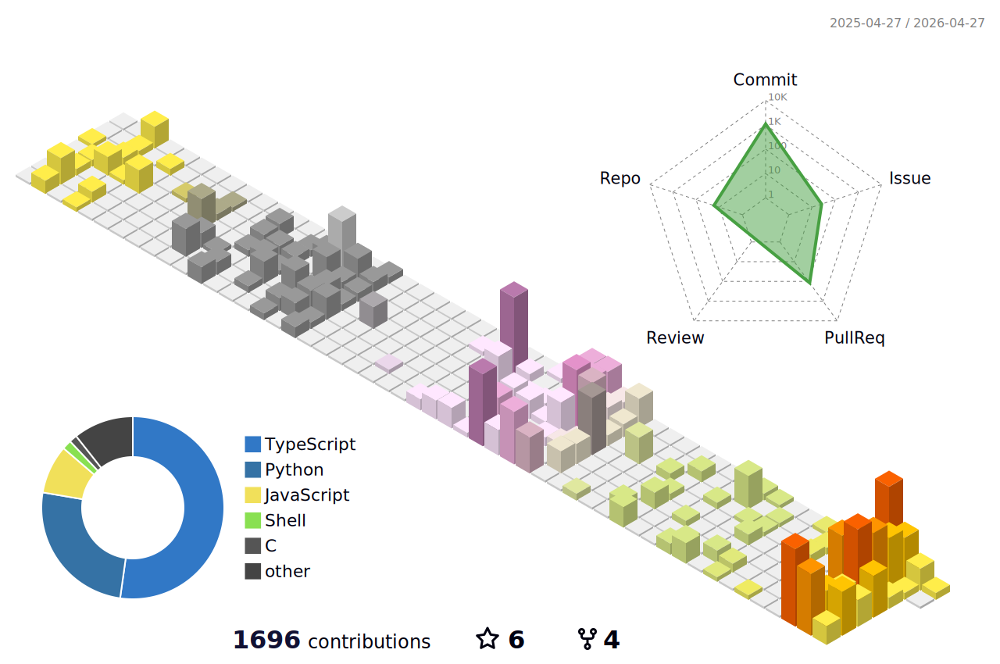

  
  
   

---

### About Me
Hi, I'm **Daniel Lee** .
Building intelligent systems and exploring the intersection of **AI Agents** and **Multimodal Applications**. 
Currently, I am expanding my research from text-based RAG to **Vision-Language Models (VLM)** and **Graph RAG** to solve complex real-world problems.

### <picture><source media="(prefers-color-scheme: dark)" srcset="https://api.iconify.design/heroicons:trophy-solid.svg?color=%23ffffff"><source media="(prefers-color-scheme: light)" srcset="https://api.iconify.design/heroicons:trophy-solid.svg?color=%23000000"></picture> Awards & Honors

**2025**
- **Top Excellence Award (Institute for Information & Communication Technology Planning & Evaluation Director's Award)**
  - **10th SW Talent Festival** | Project: *Smart Food Research Agent System*
- **Silver Medal**
  - **Korea University Uni-con Startup Competition** | Project: *e:room - AI Roommate Matching & Fraud Detection Platform*

### <picture><source media="(prefers-color-scheme: dark)" srcset="https://api.iconify.design/heroicons:academic-cap-solid.svg?color=%23ffffff"><source media="(prefers-color-scheme: light)" srcset="https://api.iconify.design/heroicons:academic-cap-solid.svg?color=%23000000"></picture> Publications

- **[HCLT 2025] Enhancing Multi-Hop Complex Query Retrieval Efficiency through the Integration of RAG and Graph RAG**
  -  <b>1st Author</b> | The 37th Annual Conference on Human and Cognitive Language Technology
  - Proposed a hybrid framework combining RAG and Graph RAG to optimize search efficiency for complex queries.
  
### <picture><source media="(prefers-color-scheme: dark)" srcset="https://cdn.simpleicons.org/rocket/white"><source media="(prefers-color-scheme: light)" srcset="https://cdn.simpleicons.org/rocket/black"></picture> Featured Projects

**Smart Food Research Hub (Crowdworks x KU) ([go to repo](https://github.com/danlee-dev/crowdworks-multiagent-system.git))**
* **🏆 Top Excellence Award (10th SW Talent Festival)**
* Developed a Multi-Agent RAG system for the food industry using Crawlers, Graph DB, and Elasticsearch to automate market research.

**Uni-con - e:room Platform ([go to repo](https://github.com/danlee-dev/uni-con))**
* **🥈 Silver Medal Winner (KU Startup Competition)**
* Smart roommate matching & real estate management platform featuring AI-based lease fraud detection.

**Docscanner.ai - Legal Tech Solution ([go to repo](https://github.com/danlee-dev/252RCOSE48001.git))**
* **KU Industry-Academic Capstone Design**
* **Contract Analysis AI**: Automatically detects toxic clauses, missing items, and unfair terms in employment contracts.
* **Tech**: Next.js, NestJS, FastAPI, Gemini 2.5, KURE-v1 (Legal Embedding), Elasticsearch.

**Research Focus**
* **Multimodal AI & Vision-Language Models (VLM)**
* Retrieval-Augmented Generation (RAG) & Graph RAG
* Multi-Agent Systems & Legal AI

### <picture><source media="(prefers-color-scheme: dark)" srcset="https://cdn.simpleicons.org/github/white"><source media="(prefers-color-scheme: light)" srcset="https://cdn.simpleicons.org/github/black"></picture> Projects HUB

<table>
<tr>
<td width="33%" align="center">

**[AI Project Hub](https://github.com/danlee-dev/ai-project-hub)**
 
Building small AI apps, demos & services
  

</td>
<td width="33%" align="center">

**[AI Paper Impl](https://github.com/danlee-dev/ai-paper-implementations)**
 
Impl of ViT, Diffusion, Transformer
  

</td>
<td width="33%" align="center">

**[CS Core Labs](https://github.com/danlee-dev/cs-core-labs)**
 
OS, Logic Design, Multicycle CPU
  

</td>
</tr>
</table>

### <picture><source media="(prefers-color-scheme: dark)" srcset="https://cdn.simpleicons.org/stackshare/white"><source media="(prefers-color-scheme: light)" srcset="https://cdn.simpleicons.org/stackshare/black"></picture> Tech Stack

  

**Currently Learning:** Large Multimodal Models (LMM), Graph Neural Networks, Advanced RAG

### <picture><source media="(prefers-color-scheme: dark)" srcset="https://cdn.simpleicons.org/chartdotjs/white"><source media="(prefers-color-scheme: light)" srcset="https://cdn.simpleicons.org/chartdotjs/black"></picture> GitHub Analytics

   

  

### <picture><source media="(prefers-color-scheme: dark)" srcset="https://cdn.simpleicons.org/target/white"><source media="(prefers-color-scheme: light)" srcset="https://cdn.simpleicons.org/target/black"></picture> Life Vision
*"Building AI systems that **change the world**, one intelligent solution at a time."*

### Connect With Me

  

 

<h3 align="center">
  <picture>
    <source media="(prefers-color-scheme: dark)" srcset="https://api.iconify.design/heroicons:chart-bar-solid.svg?color=%23ffffff">
    <source media="(prefers-color-scheme: light)" srcset="https://api.iconify.design/heroicons:chart-bar-solid.svg?color=%23000000">
    
  </picture>
  My Contribution History (3D View)
</h3>

  <picture>
    <source media="(prefers-color-scheme: dark)" srcset="./profile-3d-contrib/profile-night-rainbow.svg">
    <source media="(prefers-color-scheme: light)" srcset="./profile-3d-contrib/profile-south-season.svg">
    
  </picture>
   
  <i>Visualizing my coding activity and commits over the last year.</i>

---

  
   
  <b>Thanks for visiting!</b>
   
  <i>"Code is like humor. When you have to explain it, it's bad." – Cory House</i>

